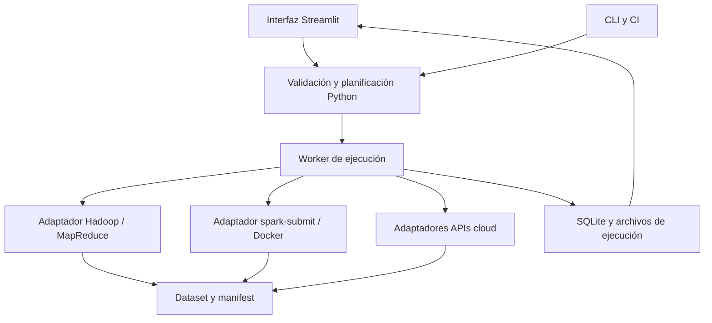

# Generación, plataformas cloud y control mediante Streamlit

Propuesta de arquitectura, 7 de octubre de 2026. Complementa la [auditoría Spark 3.5.9](compatibilidad-spark-3.5.md). No es una implementación de la interfaz ni una certificación de servicios cloud: las pruebas realizadas hasta ahora son las del clúster Docker local descritas en la auditoría.

## 1. Mantener preparación y benchmark como fases independientes

HiBench separa generación de datos y algoritmo. La preparación actual combina jobs MapReduce y generadores Spark según el workload: RandomTextWriter para WordCount/Sort, TeraGen para TeraSort/Repartition, DataGen para SQL/Bayes/PageRank, el generador Mahout de KMeans y generadores Scala para varios datasets ML. Por tanto, no todo `prepare` es MapReduce.

Las llamadas `JobClient.runJob` en `HiveData`, `BayesData`, `PagerankData` y `GenKMeansDataset` confirman que esas rutas requieren ejecución Hadoop real; disponer de librerías Hadoop dentro de Spark no proporciona un servicio MapReduce.

Separar tres artefactos mantenibles:

- `datagen-legacy`: generadores Hadoop/MapReduce preservados para reproducción histórica.
- `datagen-spark`: generadores DataFrame modernos con esquemas estables, semillas explícitas y salida Parquet.
- `workloads-spark`: algoritmos que reciben un dataset identificado, parámetros y destino de resultados.

La preparación puede ejecutarse en un destino y el algoritmo en otro. Para comparar proveedores, conviene generar una vez, validar y replicar el mismo dataset. Registrar seed, versión del generador, esquema, filas, particiones, tamaño lógico y archivos/checksums o identificadores de versión. Parquet cambia bytes físicos y compresión respecto a SequenceFile; comparar tamaños lógicos y físicos explícitamente, sin asumir equivalencia byte a byte.

La interfaz debe ofrecer `Preparar`, `Ejecutar benchmark` y `Preparar y ejecutar`. Reutilizar requiere comprobar manifest y finalización, no solo existencia de una carpeta. La regeneración debe crear una nueva versión del dataset; una eliminación de datos existentes es una operación separada.

## 2. Java: runtime y bytecode son decisiones diferentes

El JAR Java 8 puede ejecutarse normalmente en Java 11/17 si sus dependencias y APIs son compatibles. Actualizar Java no obliga a reescribir el generador. Sin embargo, hay que comprobar librerías antiguas, accesos internos y ejecución real. `autogen` compiló con dependencias Hadoop 3.3.4 en la auditoría; sus jobs MapReduce no se han validado funcionalmente todavía en Hadoop 3.3.6.

Para el perfil local: build reproducible con JDK 11 y ejecución Java 11, heredando `JAVA_HOME`. Eliminar la ruta Java 8 impuesta en `run_all.sh`. Se puede conservar temporalmente bytecode 8 o adoptar 11 según la matriz de soporte elegida. Para compilar Java con un target antiguo usar `--release` cuando el JDK lo permita; la compilación Scala requiere su configuración equivalente.

Para cloud: seleccionar perfil concreto Spark/Scala/JDK y artefacto compatible. Synapse Spark 3.5 publica Java 17 y Scala 2.12.18. Fabric 1.3 publica Spark 3.5/Java 11/Scala 2.12; Fabric 2.0 publica Spark 4.1/Java 21/Scala 2.13. El paso `_2.12` → `_2.13` requiere recompilación de Scala y dependencias, no basta cambiar `JAVA_HOME`. [Synapse](https://learn.microsoft.com/en-us/azure/synapse-analytics/spark/apache-spark-35-runtime), [Fabric 1.3](https://learn.microsoft.com/en-us/fabric/data-engineering/runtime-1-3), [Fabric 2.0](https://learn.microsoft.com/en-us/fabric/data-engineering/runtime-2-0).

No imponer una sola versión Java a todo HiBench: el generador legacy puede mantenerse en Hadoop/Java 11 aunque el algoritmo se ejecute con otro JDK en un servicio gestionado.

## 3. Matriz de viabilidad por plataforma

Esta tabla describe rutas de integración posibles y límites, no resultados de pruebas en esas plataformas.

| Destino | Preparación MapReduce actual | Algoritmos Spark | Lanzamiento previsto |
|---|---|---|---|
| Docker Hadoop/YARN actual | Es el primer destino para validarlos | Compatibilidad parcial ya demostrada | Hadoop CLI / spark-submit |
| AWS EMR sobre EC2 | Servicio Hadoop/MapReduce disponible | Candidato para módulos clásicos, adaptando versión/storage | Steps/API o submit en el clúster |
| Google Dataproc con clúster | Jobs Hadoop disponibles | Candidato para módulos clásicos, adaptando versión/storage | Dataproc Jobs API |
| Azure HDInsight Hadoop/Spark con YARN apropiado | Posible con los componentes del clúster | Candidato; historial del proyecto no valida nuevos runtimes | Submit/servicio del clúster |
| Azure Synapse Spark | No usar el prepare MapReduce/YARN existente como contrato del pool | Jobs Spark adaptados a runtime y ADLS | API de batch/Spark jobs |
| Microsoft Fabric | Preparar fuera o migrar a Spark | Jobs Scala/Java mediante Spark Job Definition, con runtime y Lakehouse | API/job definition |
| AWS EMR Serverless, jobs batch Spark | No ofrece el contrato de job MapReduce de este runner | Admite JAR Scala/Java; evaluar RDD y dependencias por release | StartJobRun, entryPoint y parámetros |
| Google Serverless for Apache Spark, batch | No ofrece el runner Hadoop/YARN existente | Admite batch Scala/Java; evaluar capacidades por runtime | Batches API / gcloud |
| Databricks clásico | MapReduce fuera; no tratar Spark como servicio Hadoop MR | Candidato según runtime y access mode | Jobs API, tarea JAR |
| Databricks serverless | MapReduce fuera o generador compatible | Subconjunto Spark Connect; sin RDD/SparkContext ni internals; verificar ML | Jobs API, tarea JAR compatible o Python |

EMR incluye Hadoop y MapReduce; Dataproc documenta submission Hadoop; HDInsight ofrece Hadoop/MapReduce. La compatibilidad exacta depende del tipo de clúster elegido. [EMR Hadoop](https://docs.aws.amazon.com/emr/latest/ReleaseGuide/emr-hadoop.html), [Dataproc Hadoop jobs](https://docs.cloud.google.com/sdk/gcloud/reference/dataproc/jobs/submit), [HDInsight Hadoop](https://learn.microsoft.com/en-us/azure/hdinsight/hadoop/apache-hadoop-introduction).

EMR Serverless documenta Spark/Hive y jobs JAR por Spark submit; Google Serverless documenta batch Spark Java/Scala. **No trasladar automáticamente la prohibición RDD de Databricks a esos servicios**: batch Spark y sesiones Spark Connect son interfaces diferentes. Validar la API usada, release y librerías. [EMR Serverless](https://docs.aws.amazon.com/emr/latest/EMR-Serverless-UserGuide/emr-serverless.html), [jobs JAR EMR](https://docs.aws.amazon.com/emr/latest/EMR-Serverless-UserGuide/jobs-spark.html), [Google Serverless](https://docs.cloud.google.com/dataproc-serverless/docs/overview).

Fabric permite archivos JAR en Spark Job Definitions y requiere un Lakehouse asociado. Su API de definición V2 no acepta subir JAR inline como partes Main/Libs; documenta referencias externas `abfss://`. Es un detalle que el adaptador deberá resolver, no una limitación del algoritmo matemático. [Spark Job Definition](https://learn.microsoft.com/en-gb/fabric/data-engineering/spark-job-definition), [API de definición](https://learn.microsoft.com/en-us/rest/api/fabric/articles/item-management/definitions/spark-job-definition).

Fabric 1.3 está en etapa EOSA; para soporte futuro debe contemplarse 2.0 y validarse la disponibilidad del runtime que el usuario seleccione. No asumir que todos los servicios gestionados ejecutan Spark 3.5.9 exactamente.

Databricks serverless admite tareas JAR compatibles con Connect, pero no el JAR clásico actual. Además no admite cache/persist de DataFrame y restringe internals/JNI, almacenamiento y configuración. ML debe validarse por algoritmo y entorno. [JAR serverless](https://docs.databricks.com/aws/en/jobs/how-to/use-jars-in-workflows), [limitaciones](https://docs.databricks.com/aws/en/compute/serverless/limitations).

## 4. Streamlit como interfaz de un runner reutilizable

Streamlit encaja para una interfaz sencilla de experimentación: formularios, selección de workloads, tablas de estado, logs y descarga de resultados. La lógica de ejecución debe vivir en un paquete Python independiente, utilizable también por CLI y CI. Así se puede ejecutar un experimento sin navegador o restaurar su estado después de recargar la página.



Para el primer MVP bastan un worker separado, SQLite y archivos de log; no hace falta introducir Kubernetes, Redis, Celery ni una API web adicional. El worker conserva jobs duraderos y usa la API de estado del proveedor como fuente de verdad para trabajos remotos. Si se añade multiusuario/distribución después, sustituir el almacenamiento y cola sin cambiar los workloads.

Interfaces de adaptador propuestas: `validate`, `submit`, `status`, `logs`, `cancel` y `collect_results`. MapReduce y Spark pueden implementarlas de forma distinta. El contrato común es la ejecución y sus resultados, no una cadena universal de spark-submit.

### Flujo visible

1. Elegir destino/runtime y perfil de recursos.
2. Seleccionar workloads compatibles y orden de ejecución.
3. Configurar escala preset o valores explícitos: filas, dimensiones, clusters, iteraciones, seed y particiones según workload.
4. Elegir dataset existente o preparación, rutas input/output y formato.
5. Ajustar recursos/configuraciones permitidos por el destino y guardar/exportar experimento.
6. Ejecutar: mostrar fase activa, workloads completados, logs incrementales, ID, enlace al job/UI del proveedor y cancelación.
7. Mostrar corrección y métricas, comparar repeticiones y descargar resultados.

El formulario debe ocultar opciones no soportadas. Por ejemplo, número de ejecutores fijo y cache no se deben presentar como controles garantizados en todos los proveedores. El estado debe distinguir pending/submitted/running/succeeded/failed/cancelled y mantener preparación separada del benchmark. No deducir éxito de la palabra "finished" en un log ni porcentaje real de la cuenta de líneas.

### Seguimiento en vivo

Streamlit vuelve a ejecutar scripts al interactuar; pulsar Run crea un `run_id` persistente y una solicitud idempotente al worker. La página consulta estado y lee solo nuevos eventos/logs. Para refrescar el panel se puede usar `st.fragment(run_every=...)`, soportado oficialmente mientras la sesión está activa. [Streamlit fragments](https://docs.streamlit.io/develop/api-reference/execution-flow/st.fragment).

Evitar que un proceso largo de spark-submit dependa de `session_state` o del ciclo de vida de una pestaña. Los workers no deberían invocar `st.*`; Streamlit documenta las particularidades del contexto de sus threads. [Threading](https://docs.streamlit.io/develop/concepts/design/multithreading).

Logs cloud pueden aparecer con retraso; mostrar estado, última actualización y logs disponibles sin prometer una terminal idéntica al submit local. El progreso por etapas puede calcularse cuando existan métricas reales; en otro caso mostrar actividad y tiempo transcurrido.

## 5. Configuración estructurada

Sustituir `.lst` y la concatenación de `.conf` por:

- Catálogo versionado de workloads: entrypoint, generador, esquema, parámetros, presets y capacidades necesarias.
- Perfiles de destino: provider, runtime/build compatible, storage, recursos y forma de submission.
- Experimento YAML/JSON: selección, datasets, overrides y repeticiones.
- Plan resuelto inmutable por ejecución, con hash, versiones y parámetros efectivos.

Ejemplo conceptual; no es aún una configuración implementada:

```yaml
schema_version: 1
name: batch-baseline
benchmark_target: docker-yarn-spark359
preparation_target: docker-hadoop336
dataset_policy: reuse_if_manifest_matches
seed: 42
repetitions: 3
storage:
  input_root: hdfs://spark-cluster-master:9000/HiBench/datasets
  results_root: hdfs://spark-cluster-master:9000/HiBench/runs
workloads:
  - id: micro.wordcount
    scale: tiny
  - id: ml.kmeans
    parameters:
      rows: 100000
      dimensions: 20
      k: 10
      max_iter: 20
resources:
  executor_instances: 1
  executor_cores: 1
  executor_memory: 1g
  driver_memory: 1g
  shuffle_partitions: 2
```

UI y CLI usan el mismo validador/schema; importar/exportar produce experimentos reproducibles. Un importer inicial puede convertir los `.conf/.lst` actuales y avisar de parámetros obsoletos, conservando el valor efectivo conocido. Mantener credenciales fuera del experimento y usar identidades/perfiles de conexión del entorno.

Cada run guarda configuración resuelta, versiones, dataset manifest, tiempos de preparación/submission/arranque/lectura/cómputo/escritura cuando sean observables, estado, ID remoto, logs y comprobaciones de resultado. El benchmark puede medir end-to-end y cómputo como métricas distintas; no mezclar generación con entrenamiento sin declararlo.

## 6. Alcance recomendado de la primera versión

1. Corregir la base Spark 3.5.9 y las inconsistencias identificadas en la auditoría.
2. Implementar catálogo/configuración y runner Python 3 con `doctor`, `prepare`, `run`, `status`, `cancel`, `report`.
3. Primer adaptador Docker/YARN; dos o tres workloads representativos: WordCount, una operación SQL y KMeans después de reparar ML.
4. Añadir Streamlit usando ese runner: editor de experimentos, Run, estado/logs persistentes y resultados.
5. Migrar datasets a Parquet y ampliar cobertura de workloads.
6. Incorporar adaptadores cloud de uno en uno con smoke tests en el servicio real. No ofrecer soporte simultáneo de todos los proveedores en el MVP.

Criterios del MVP: recargar/cerrar navegador no cancela jobs; pulsar Run dos veces no duplica una misma solicitud; errores remotos aparecen como fallo; cancelación confirma el estado remoto; inputs reutilizados tienen manifest válido; cada resultado se asocia a su experimento resuelto. La ejecución CLI produce los mismos jobs y resultados que la UI.
